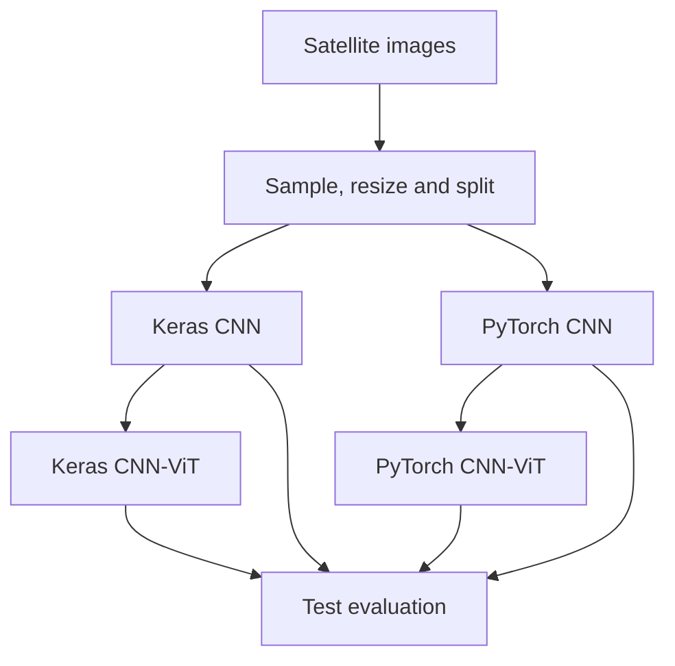

# Satellite Land Classification with CNN and CNN-ViT

An educational satellite image classification project using **Keras** and **PyTorch**. It compares convolutional neural networks (CNNs) with lightweight CNN–Transformer hybrids to identify:

- `class_0_non_agri` — non-agricultural land
- `class_1_agri` — agricultural land

The repository contains the image dataset, nine executed notebooks with saved outputs, four trained model checkpoints, and evaluation results.

## Architecture



Each CNN-ViT hybrid uses features from its trained CNN with frozen weights, followed by an attention or Transformer component. All four models are evaluated on the same test images.

## Project overview

| Item | Details |
| --- | --- |
| Task | Binary satellite image classification |
| Frameworks | TensorFlow/Keras and PyTorch |
| Models | Two CNNs and two CNN-ViT hybrids |
| Dataset | 6,000 images: 3,000 per class |
| Image size | 64 × 64 RGB |
| Default training | 240 images per class, 2 epochs |
| Data split | 70% training, 15% validation, 15% testing |
| Random seed | 7331 |

## Saved results

These results come from the default demonstration run. All models were tested on the same **72 images**.

| Model | Accuracy | F1 score | ROC-AUC |
| --- | ---: | ---: | ---: |
| Keras CNN | 93.06% | 0.9254 | 0.9684 |
| PyTorch CNN | 86.11% | 0.8387 | 0.9252 |
| Keras CNN-ViT | 93.06% | 0.9275 | 0.9707 |
| PyTorch CNN-ViT | 88.89% | 0.8824 | 0.9182 |

Detailed results are available in [`results/final_comparison.csv`](results/final_comparison.csv) and the JSON files inside [`results/`](results/). These numbers describe a small demonstration run and are not estimates of production performance.

## Repository structure

| Path | Purpose |
| --- | --- |
| [`data/images-dataSAT.tar`](data/images-dataSAT.tar) | Image dataset archive |
| [`notebooks/`](notebooks/) | Nine notebooks with saved code outputs |
| [`models/`](models/) | Four trained model checkpoints |
| [`results/`](results/) | Metrics and comparison tables |
| [`common.py`](common.py) | Data preparation, splitting, and evaluation helpers |
| [`keras_models.py`](keras_models.py) | Keras model architectures |
| [`torch_models.py`](torch_models.py) | PyTorch models and training helpers |
| [`run_all.py`](run_all.py) | Runs all notebooks in order |
| [`execute_notebook.py`](execute_notebook.py) | Executes cells and saves their outputs |
| [`requirements.txt`](requirements.txt) | Python dependencies |

## Notebook order

| # | Notebook | Topic |
| --- | --- | --- |
| 01 | [`01_memory_vs_generator.ipynb`](notebooks/01_memory_vs_generator.ipynb) | Dataset inspection and loading methods |
| 02 | [`02_keras_data_augmentation.ipynb`](notebooks/02_keras_data_augmentation.ipynb) | Keras data loading and augmentation |
| 03 | [`03_pytorch_data_augmentation.ipynb`](notebooks/03_pytorch_data_augmentation.ipynb) | PyTorch datasets and transformations |
| 04 | [`04_keras_cnn.ipynb`](notebooks/04_keras_cnn.ipynb) | Keras CNN training and evaluation |
| 05 | [`05_pytorch_cnn.ipynb`](notebooks/05_pytorch_cnn.ipynb) | PyTorch CNN training and evaluation |
| 06 | [`06_compare_cnn.ipynb`](notebooks/06_compare_cnn.ipynb) | CNN comparison |
| 07 | [`07_keras_cnn_vit.ipynb`](notebooks/07_keras_cnn_vit.ipynb) | Keras CNN-ViT hybrid |
| 08 | [`08_pytorch_cnn_vit.ipynb`](notebooks/08_pytorch_cnn_vit.ipynb) | PyTorch CNN-ViT hybrid |
| 09 | [`09_final_evaluation.ipynb`](notebooks/09_final_evaluation.ipynb) | Final comparison of all four models |

The notebooks already have saved outputs, so their results can be viewed directly on GitHub.

## Run on Windows

Install **Python 3.12**. Download the repository using **Code → Download ZIP**, extract it, and open **PowerShell** in the folder containing `run_all.py`.

### Install dependencies

```powershell
py -3.12 -m venv .venv
.\.venv\Scripts\python.exe -m pip install --upgrade pip
.\.venv\Scripts\python.exe -m pip install -r requirements.txt
```

### Run all notebooks

```powershell
.\.venv\Scripts\python.exe run_all.py
```

This runs notebooks **01 to 09** in order. The dataset archive is extracted automatically. The script trains the models, updates `models/` and `results/`, and saves the new outputs inside the notebooks.

The default run uses **480 images**: 336 for training, 72 for validation, and 72 for testing.

### Optional: run on the full dataset

This mode uses all **6,000 images** and **8 training epochs**:

```powershell
$env:LAND_RUN_MODE = "full"
.\.venv\Scripts\python.exe run_all.py
```

The full run takes longer, and its results can differ from the saved demonstration results.

## Evaluation notes

The dataset is sampled and split by class using seed `7331`. Model selection uses validation results; final comparison uses the same held-out test images for all four models. The saved JSON files include accuracy, precision, recall, F1, ROC-AUC, and confusion matrices.

The four included checkpoints were trained with this project's code because the originally supplied Keras model archive could not be loaded. The notebooks were cleaned and rebuilt from the supplied lab material. A spatially independent test set would be needed before drawing conclusions about performance on new satellite scenes.

Author : Rushikesh Patil Business Intellegence and Data Science Student ISM, Dortmund
